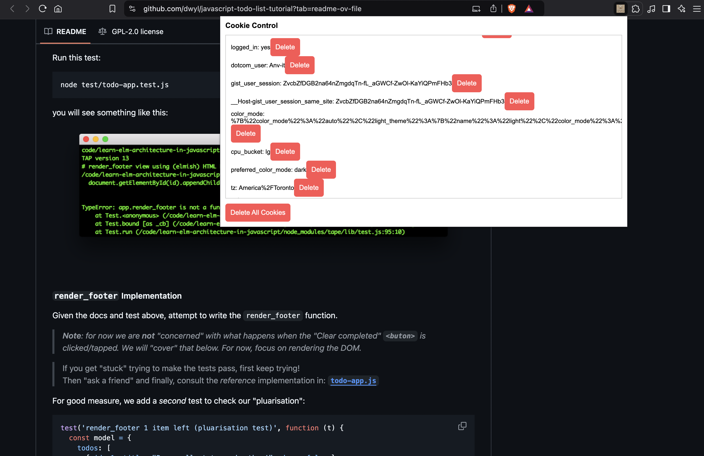

# Cookie Control Extension

A lightweight and user-friendly browser extension to manage cookies for the current website. With this extension, you can view, delete individual cookies, or remove all cookies for a domain in just a few clicks.

---

## Features
- **View Cookies:** Display all cookies for the current website, including their names and values.
- **Delete Individual Cookies:** Remove specific cookies directly from the popup interface.
- **Delete All Cookies:** Clear all cookies for the active website with a single click.
- **Clean & Simple Interface:** A minimalistic design to make cookie management quick and easy.

---

## Screenshots

### Cookie List


---

## Installation

1. **Download or Clone the Repository:**
   ```bash
   git clone https://github.com/Anv-it/cookie-control.git
   ```

2. **Load as Unpacked Extension:**
   - Open your browser and navigate to `chrome://extensions/`.
   - Enable "Developer mode" (toggle on in the top-right corner).
   - Click on "Load unpacked" and select the folder containing this project.

3. **Start Using the Extension:**
   - The Cookie Manager icon will appear in your browser toolbar. Click it to access the popup interface.

---

## File Structure

```plaintext
cookie-manager/
├── manifest.json       # Configuration file for the extension
├── popup.html          # HTML structure for the popup interface
├── popup.js            # JavaScript logic for managing cookies
├── background.js       # (Optional) Background script for advanced features
├── styles.css          # Styling for the popup interface
└── icons/              # Folder for extension icons
    ├── icon16.png
    ├── icon48.png
    └── icon128.png
```

---

## Usage

1. Click on the extension icon in your browser toolbar.
2. The popup will display all cookies for the current website.
3. **To Delete a Cookie:**
   - Click the "Delete" button next to the cookie you want to remove.
4. **To Delete All Cookies:**
   - Click the "Delete All Cookies" button to remove all cookies for the current domain.

---

## Permissions
This extension requires the following permissions:
- **Cookies:** To access and manage cookies for the current website.
- **Active Tab:** To fetch the domain of the active tab for displaying cookies.

<!-- --- -->

<!-- ## Future Enhancements
- Add a search bar to filter cookies by name.
- Implement a blacklist/whitelist for cookie management.
- Provide detailed information about cookies (e.g., expiration, path, HTTP-only flag). -->

---

## License
This project is licensed under the MIT License. Feel free to use, modify, and distribute it as you like.

---

## Contribution
Contributions are welcome! If you have ideas or improvements, please:
1. Fork the repository.
2. Create a new branch for your feature.
3. Submit a pull request explaining your changes.

---

## Contact
For any questions or feedback, reach out at: [anvitbindra1996@gmail.com]
